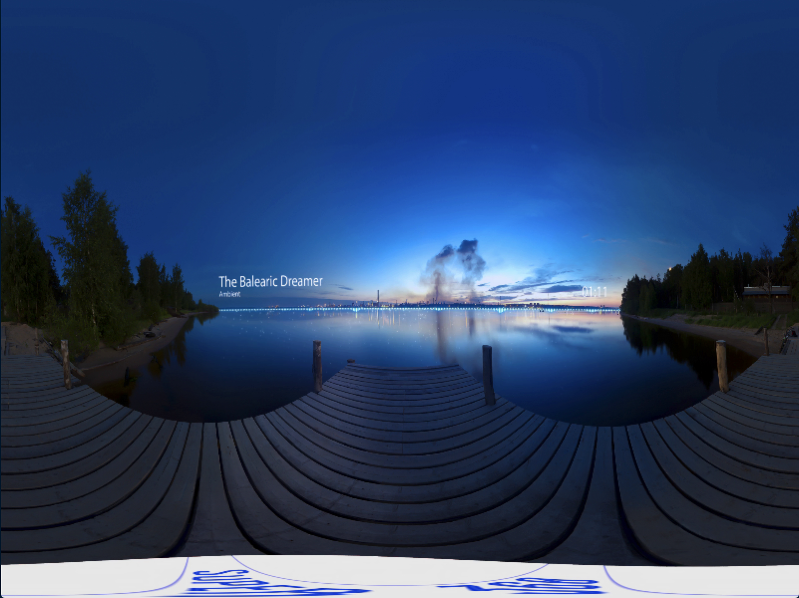

# panoramic-video-detector

##### Compare side column pixels for first frame of test video (https://www.youtube.com/watch?v=K_J8k43gUhY):

| Left Side Column | Right Side Column |
| ----------------- | ----------------- |
|B: 93, G: 90, R: 91|B: 93, G: 90, R: 91|
|B: 93, G: 90, R: 91|B: 93, G: 90, R: 91|
|B: 93, G: 90, R: 91|B: 93, G: 90, R: 91|
|B: 93, G: 90, R: 91|B: 93, G: 90, R: 91|
|B: 93, G: 90, R: 91|B: 93, G: 90, R: 91|
|B: 93, G: 90, R: 91|B: 93, G: 90, R: 91|
|B: 93, G: 90, R: 91|B: 93, G: 90, R: 91|
|B: 93, G: 90, R: 91|B: 92, G: 89, R: 90|
|B: 92, G: 89, R: 90|B: 92, G: 89, R: 90|
|B: 92, G: 89, R: 90|B: 92, G: 89, R: 90|
|B: 92, G: 89, R: 90|B: 92, G: 89, R: 90|
|B: 92, G: 89, R: 90|B: 92, G: 89, R: 90|
|B: 92, G: 89, R: 90|B: 92, G: 89, R: 90|
|B: 92, G: 89, R: 90|B: 92, G: 89, R: 90|
|B: 92, G: 89, R: 90|B: 92, G: 89, R: 90|
|B: 92, G: 89, R: 90|B: 91, G: 88, R: 89|
|B: 91, G: 88, R: 89|B: 91, G: 88, R: 89|
|B: 91, G: 88, R: 89|B: 91, G: 88, R: 89|
|B: 91, G: 88, R: 89|B: 91, G: 88, R: 89|
|B: 91, G: 88, R: 89|B: 91, G: 88, R: 89|
|B: 91, G: 88, R: 89|B: 91, G: 88, R: 89|
|B: 91, G: 88, R: 89|B: 91, G: 88, R: 89|
|B: 91, G: 88, R: 89|B: 91, G: 88, R: 89|
|B: 91, G: 88, R: 89|B: 90, G: 87, R: 88|
|B: 90, G: 87, R: 88|B: 90, G: 87, R: 88|
|B: 90, G: 87, R: 88|B: 90, G: 87, R: 88|
|B: 90, G: 87, R: 88|B: 90, G: 87, R: 88|
|B: 90, G: 87, R: 88|B: 90, G: 87, R: 88|
|B: 90, G: 87, R: 88|B: 90, G: 87, R: 88|
|B: 90, G: 87, R: 88|B: 90, G: 87, R: 88|
|B: 90, G: 87, R: 88|B: 90, G: 87, R: 88|
|...|...|

Observe from sample data, probably we can take advantage of this to detect panoramic video.

##### Strict pixel compare result:

| Video | Equal Rate |
| ----- | ---------: |
|360 Google Spotlight Story HELP.mp4|0.805556|
|360 Google Spotlight Story Special Delivery.mp4|0.784375|
|360 Stereo Music _ The Balearic Dreamer (Ambient).mp4|0.393056|
|360 Stereo Music - Trapped in Cello (instrumental).mp4|0.239815|
|360 Video - Take a ride on Elon Musk’s Hyperloop.mp4|0.998958|
|360 video VR Girl - Natasha In The Bathroom (video girl for oculus rift).mp4|0.535937|
|Assassin’s Creed Syndicate - Jack the Ripper Interactive 360° Trailer [US].mp4|0.759375|
|Clash of Clans 360 Experience a Virtual Reality Raid.mp4|0.490234|
|Experience Vivid Sydney - Week 1 (360 video).mp4|0.657292|
|FFZERO1 Concept (No Audio).mp4|0.65625|
|Foreign_Nature_by_J_Horsthuis_low-bitrate.mp4|0.157|
|Invasion! Sneak Peek 360.mp4|0.417593|
|Meteor Rain in amazing sky.mp4|0.469792|
|Redfoo - Booty Man (Official 360° Music Video).mp4|0.982292|
|Take Flight 360 VR.mp4|0.758854|
|THE CLIMB - Alps 360° Trailer (VR Game).mp4|0.404167|
|Through Mowgli's Eyes Part II Cold Lairs - Disney's The Jungle Book.mp4|0.248047|
|Unreal Engine 4 Showdown VR 360° 4K by 3Ds Saviel.mp4|0.327315|
|WARCRAFT.mp4|0.23125|
|林俊傑 JJ Lin – 彈唱 A Song for You Till the End of Time (360 HD MV 華納Official).mp4|0.928125|

Using middle frame, but some of results are not promising...

##### Take one of the low rate and inspect:

* The frame image:

* The compare info:

| Left Side Column | Right Side Column | Equal |
| ----------------- | ----------------- | ---: |
|B: 107, G: 49, R: 18|B: 107, G: 49, R: 18|Yes|
|B: 107, G: 49, R: 18|B: 109, G: 49, R: 16|No|
|B: 109, G: 49, R: 16|B: 109, G: 49, R: 16|Yes|
|B: 109, G: 49, R: 16|B: 110, G: 49, R: 19|No|
|B: 110, G: 49, R: 19|B: 110, G: 49, R: 19|Yes|
|B: 110, G: 49, R: 19|B: 109, G: 49, R: 16|No|
|B: 109, G: 49, R: 16|B: 109, G: 49, R: 16|Yes|
|B: 109, G: 49, R: 16|B: 109, G: 49, R: 16|Yes|
|B: 109, G: 49, R: 16|B: 109, G: 49, R: 16|Yes|
|B: 109, G: 49, R: 16|B: 109, G: 48, R: 18|No|
|B: 109, G: 48, R: 18|B: 109, G: 48, R: 18|Yes|
|B: 109, G: 48, R: 18|B: 109, G: 48, R: 18|Yes|
|B: 109, G: 48, R: 18|B: 110, G: 49, R: 19|No|
|B: 110, G: 49, R: 19|B: 110, G: 50, R: 17|No|
|B: 110, G: 50, R: 17|B: 109, G: 49, R: 16|No|
|B: 109, G: 49, R: 16|B: 109, G: 48, R: 18|No|
|B: 109, G: 48, R: 18|B: 109, G: 48, R: 18|Yes|
|B: 109, G: 48, R: 18|B: 110, G: 50, R: 17|No|
|B: 110, G: 50, R: 17|B: 110, G: 50, R: 17|Yes|
|B: 110, G: 50, R: 17|B: 109, G: 49, R: 16|No|
|B: 109, G: 49, R: 16|B: 109, G: 49, R: 16|Yes|
|B: 109, G: 49, R: 16|B: 109, G: 48, R: 18|No|
|B: 109, G: 48, R: 18|B: 109, G: 48, R: 18|Yes|
|B: 109, G: 48, R: 18|B: 109, G: 49, R: 16|No|
|B: 109, G: 49, R: 16|B: 109, G: 49, R: 16|Yes|
|B: 109, G: 49, R: 16|B: 111, G: 48, R: 18|No|
|B: 111, G: 48, R: 18|B: 111, G: 48, R: 18|Yes|
|B: 111, G: 48, R: 18|B: 109, G: 48, R: 18|No|
|B: 109, G: 48, R: 18|B: 109, G: 48, R: 18|Yes|
|B: 109, G: 48, R: 18|B: 109, G: 48, R: 18|Yes|
|...|...|...|

##### Try loose pixel compare:

| Left Side Column | Right Side Column | Equal |
| ----------------- | ----------------- | ---: |
|B: 107, G: 49, R: 18|B: 107, G: 49, R: 18|Yes|
|B: 107, G: 49, R: 18|B: 109, G: 49, R: 16|Yes|
|B: 109, G: 49, R: 16|B: 109, G: 49, R: 16|Yes|
|B: 109, G: 49, R: 16|B: 110, G: 49, R: 19|Yes|
|B: 110, G: 49, R: 19|B: 110, G: 49, R: 19|Yes|
|B: 110, G: 49, R: 19|B: 109, G: 49, R: 16|Yes|
|B: 109, G: 49, R: 16|B: 109, G: 49, R: 16|Yes|
|B: 109, G: 49, R: 16|B: 109, G: 49, R: 16|Yes|
|B: 109, G: 49, R: 16|B: 109, G: 49, R: 16|Yes|
|B: 109, G: 49, R: 16|B: 109, G: 48, R: 18|Yes|
|B: 109, G: 48, R: 18|B: 109, G: 48, R: 18|Yes|
|B: 109, G: 48, R: 18|B: 109, G: 48, R: 18|Yes|
|B: 109, G: 48, R: 18|B: 110, G: 49, R: 19|Yes|
|B: 110, G: 49, R: 19|B: 110, G: 50, R: 17|Yes|
|B: 110, G: 50, R: 17|B: 109, G: 49, R: 16|Yes|
|B: 109, G: 49, R: 16|B: 109, G: 48, R: 18|Yes|
|B: 109, G: 48, R: 18|B: 109, G: 48, R: 18|Yes|
|B: 109, G: 48, R: 18|B: 110, G: 50, R: 17|Yes|
|B: 110, G: 50, R: 17|B: 110, G: 50, R: 17|Yes|
|B: 110, G: 50, R: 17|B: 109, G: 49, R: 16|Yes|
|B: 109, G: 49, R: 16|B: 109, G: 49, R: 16|Yes|
|B: 109, G: 49, R: 16|B: 109, G: 48, R: 18|Yes|
|B: 109, G: 48, R: 18|B: 109, G: 48, R: 18|Yes|
|B: 109, G: 48, R: 18|B: 109, G: 49, R: 16|Yes|
|B: 109, G: 49, R: 16|B: 109, G: 49, R: 16|Yes|
|B: 109, G: 49, R: 16|B: 111, G: 48, R: 18|Yes|
|B: 111, G: 48, R: 18|B: 111, G: 48, R: 18|Yes|
|B: 111, G: 48, R: 18|B: 109, G: 48, R: 18|Yes|
|B: 109, G: 48, R: 18|B: 109, G: 48, R: 18|Yes|
|B: 109, G: 48, R: 18|B: 109, G: 48, R: 18|Yes|

Seems much better...

##### Loose pixel compare result (set loose factor 7):

| Video | Equal Rate |
| ----- | ---------: |
|360 Google Spotlight Story HELP.mp4|0.993519|
|360 Google Spotlight Story Special Delivery.mp4|0.938021|
|360 Stereo Music _ The Balearic Dreamer (Ambient).mp4|0.946296|
|360 Stereo Music - Trapped in Cello (instrumental).mp4|0.594907|
|360 Video - Take a ride on Elon Musk’s Hyperloop.mp4|1|
|360 video VR Girl - Natasha In The Bathroom (video girl for oculus rift).mp4|0.964063|
|Assassin’s Creed Syndicate - Jack the Ripper Interactive 360° Trailer [US].mp4|0.999479|
|Clash of Clans 360 Experience a Virtual Reality Raid.mp4|0.919922|
|Experience Vivid Sydney - Week 1 (360 video).mp4|0.980208|
|FFZERO1 Concept (No Audio).mp4|0.989062|
|Foreign_Nature_by_J_Horsthuis_low-bitrate.mp4|0.755|
|Invasion! Sneak Peek 360.mp4|0.835648|
|Meteor Rain in amazing sky.mp4|0.894271|
|Redfoo - Booty Man (Official 360° Music Video).mp4|0.998958|
|Take Flight 360 VR.mp4|0.984896|
|THE CLIMB - Alps 360° Trailer (VR Game).mp4|0.885185|
|Through Mowgli's Eyes Part II Cold Lairs - Disney's The Jungle Book.mp4|0.835938|
|Unreal Engine 4 Showdown VR 360° 4K by 3Ds Saviel.mp4|0.863889|
|WARCRAFT.mp4|0.829861|
|林俊傑 JJ Lin – 彈唱 A Song for You Till the End of Time (360 HD MV 華納Official).mp4|0.989062|

##### TODO:
* Search for the better loose factor
* Test with non-panoramic videos
* Video surrounded by one single color probably is not 360 video
